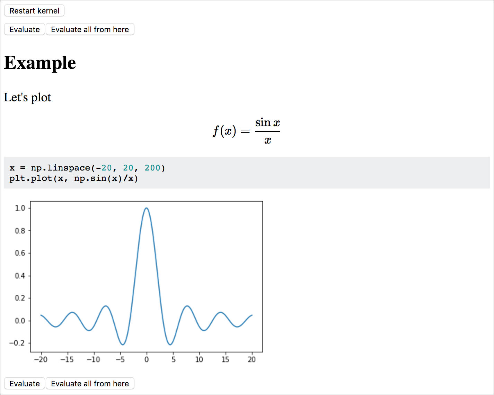

# KnitJ — Evaluate Markdown in Jupyter kernels

Inspired by [knitr](https://yihui.name/knitr/) and [R Markdown](http://rmarkdown.rstudio.com), KnitJ dynamically renders regular Markdown into HTML and evaluates Python code cells in an IPython kernel. The source Markdown file is watched for changes, and any changed code cells are reevaluated and propagated to the browser via WebSocket.

The following markdown snippet,

    ```python
    #::hide
    import numpy as np
    from matplotlib import pyplot as plt
    %matplotlib inline
    ```
    
    ## Example
    
    Let's plot
    
    $$ f(x)=\frac{\sin x}x $$
    
    ```python
    x = np.linspace(-20, 20, 200)
    plt.plot(x, np.sin(x)/x)
    ```

renders into the following HTML,



Reevaluation of code cells can be also triggered from the browser.

## Motivation

Jupyter notebooks mix source code and generated output, which has two disadvantages:

-    Source code management of the notebooks is impractical.
-    One cannot use one's favourite editor to edit the notebooks.

## Installation

```
pip3 install git+https://github.com/azag0/knitj.git
```

The following dependencies are installed:

-   [IPython](https://github.com/ipython/ipykernel) Jupyter kernel for evaluating Python code cells
-   [Jupyter Client](https://github.com/jupyter/jupyter_client) for communicating with the IPython kernel
-   [Watchdog](https://pythonhosted.org/watchdog/) for watching a file for changes
-   [ansi2html](https://github.com/ralphbean/ansi2html) for converting ANSI color codes into HTML
-   [Misaka](http://misaka.61924.nl) for rendering Markdown
-   [aiohttp](http://aiohttp.readthedocs.io) for running a http and WebSocket server
-   [Pygments](http://pygments.org) for syntax highlighting
-   [Jinja](http://jinja.pocoo.org) for HTML templates
-   [Beautiful Soup](https://www.crummy.com/software/BeautifulSoup/) for parsing HTML

## Usage

```
knitj source.md
```

This command starts watching `source.md` for changes, and opens a browser window with the rendered HTML. No Python is evaluated at this point. To evaluate the whole source file, click on `Evaluate from here` of the top code cell. `source.html` is automatically created, and all changes displayed in the browser are also saved there. When restarting , all previous output is reused from `source.html` if it exists.

`source.md` can now be edited with any editor. On saving, KnitJ reads it, and sends any changed code cells to the IPython kernel for evaluation. (Markdown changes are also propagated.)

See `knitj -h` for all options.
